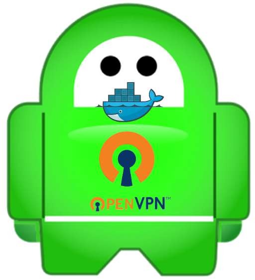
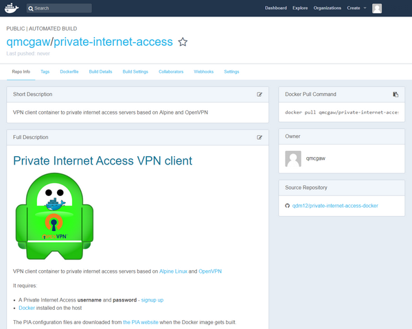

# Private Internet Access Docker (OpenVPN, Alpine)

[](https://hub.docker.com/r/qmcgaw/private-internet-access/)

This is a Docker container running your client connection to private internet access servers.

Based on [Alpine Linux](https://alpinelinux.org/) and [OpenVPN](https://openvpn.net/)

It requires:
- A [Private Internet Access account](https://www.privateinternetaccess.com/pages/buy-vpn/) (username and password)
- [Docker](https://docs.docker.com/install/) installed on the host

It also downloads the PIA configuration files directly from [their website](https://www.privateinternetaccess.com/openvpn/openvpn.zip) at the Docker image build stage.

## Installation & Testing

1. Run the *tun.sh* script on your host machine to ensure you have the **tun** device setup
    ```bash
    sudo chmod +x tun.sh
    ./tun.sh
    ```
2. Obtaining the Docker image
    - Option 1 of 2: Docker Hub Registry
        1. You can check my [Docker Hub page](https://hub.docker.com/r/qmcgaw/private-internet-access/) for more information.
            
            [](https://hub.docker.com/r/qmcgaw/private-internet-access/)
        
        2. In a terminal, download the image with:
            ```bash
            sudo docker pull qmcgaw/private-internet-access
            ```
    - Option 2 of 2: Build the image
        1. Download the repository files or `git clone` them
        2. With a terminal, go in the directory where the *Dockerfile* is located
        3. Build the image with:
            ```bash
            sudo docker build -t qmcgaw/private-internet-access ./
            ```
3. Create a file *auth.conf* in `/yourhostpath` (for example), with:
    - On the first line: your PIA username (i.e. `js89ds7`)
    - On the second line: your PIA password (i.e. `8fd9s239G`)
4. Test the container by connecting another container to it
    1. Run the container interactively with (and change the `/yourhostpath/auth.conf`):
        ```bash
        sudo docker run --rm --name=piaTEST --cap-add=NET_ADMIN --device=/dev/net/tun --dns 209.222.18.222 --dns 209.222.18.218 -e 'REGION=Romania' -v '/yourhostpath/auth.conf:/pia/auth.conf' qmcgaw/private-internet-access
        ```
        Wait about **5** seconds for it to connect to the PIA server.
    2. Check your host IP address with:
        ```bash
        curl -s ifconfig.co
        ```
    3. Run the **curl** Docker container using your *piaTEST* container with:
        ```bash
        sudo docker run --rm --net=container:piaTEST tutum/curl curl -s ifconfig.co
        ```
        If the displayed IP address appears and is different that your host IP address, your PIA OpenVPN client works !    
5. Run the container as a daemon in the background with (and change the `/yourhostpath/auth.conf`):
   
   ```bash
    sudo docker run -d --restart=always --name=pia --cap-add=NET_ADMIN --device=/dev/net/tun --dns 209.222.18.222 --dns 209.222.18.218 -e 'REGION=Romania' -v '/yourhostpath/auth.conf:/pia/auth.conf' qmcgaw/private-internet-access
    ```
   
   You can now connect other Docker containers to this VPN connection by adding `--net=container:pia` when launching them for the first time.

## Container launch parameters

- You can change the `--name=` parameter to anything you like
- You can change the `REGION=` parameter to one of the [regions supported by private internet access](https://www.privateinternetaccess.com/pages/network/)
- You must adapt the `/yourhostpath/auth.conf` path to your host path where you created `auth.conf`
    